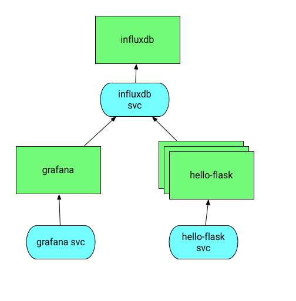

# hello-flask-k8s

Run a Flask app on Kubernetes, monitored by Telegraf/InfluxDB/Grafana.



## Usage

This example assumes you're running Kubernetes on [GKE](https://cloud.google.com/container-engine/).

### Prerequisites

Create a couple of volumes on GCE for persistent data. Note that you will be billed for these persistent disks ([but they only cost about $1/month](https://cloud.google.com/compute/pricing#persistentdisk)).

```bash
gcloud compute disks create --size=20GB influxdb-1
gcloud compute disks create --size=5GB grafana-1
```

Clone this repository to your workstation.

```bash
git clone https://github.com/ianunruh/hello-flask-k8s.git
cd hello-flask-k8s
```

### InfluxDB

Start by deploying InfluxDB

```bash
kubectl create -f influxdb-service.yml
kubectl create -f influxdb-deployment.yml
```

Wait for the InfluxDB deployment to finish, then create a database for our metrics.

```bash
POD_NAME=$(kubectl get pod -l app=influxdb -o "jsonpath={.items[0].metadata.name}")
kubectl exec $POD_NAME -it -- influx
create database production
exit
```

### Grafana

```bash
kubectl create -f grafana-service.yml
kubectl create -f grafana-deployment.yml
```

### Example Flask app

Create a [ConfigMap](http://kubernetes.io/docs/user-guide/configmap/) for Telegraf to use.

```
kubectl create configmap telegraf-config --from-file=telegraf.conf
```

Now deploy the Flask app.

```bash
kubectl create -f hello-flask-service.yml
kubectl create -f hello-flask-deployment.yml
```

Find the external IP addresses using `kubectl get svc`.

## Clean up

When you're done, you can destroy everything with the following.

```bash
kubectl delete deployments/hello-flask
kubectl delete deployments/grafana
kubectl delete deployments/influxdb
kubectl delete svc/hello-flask
kubectl delete svc/grafana
kubectl delete svc/influxdb

gcloud compute disks delete influxdb-1
gcloud compute disks delete grafana-1
```
